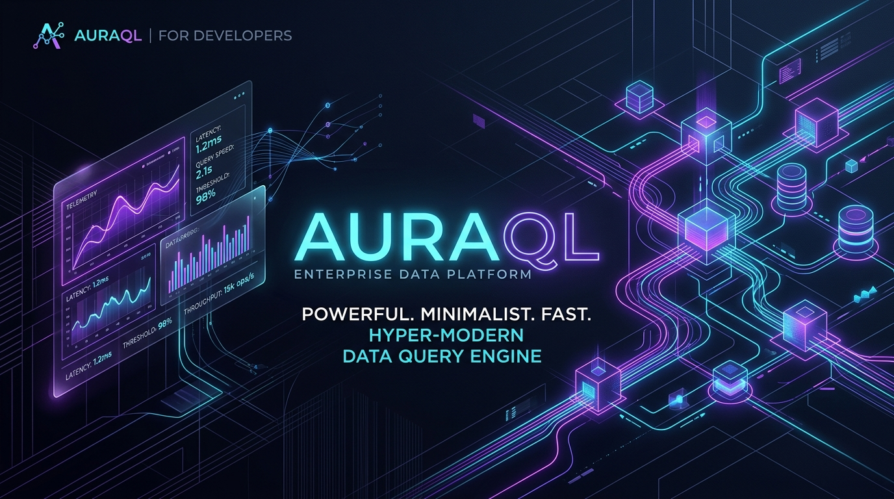

<p align="center">
  
</p>

<h1 align="center">AuraQL 🔮</h1>
<h3 align="center">Zero-Server In-Browser OLAP Analytics Studio Powered by WebMCP</h3>

<p align="center">
  <a href="#-architecture"></a>
  <a href="#-auraql-columnar-engine"></a>
  <a href="#-security--data-privacy"></a>
  <a href="#-license"></a>
</p>

---

## ⚡ Overview

**AuraQL** is a high-performance, privacy-first business intelligence and data analytics studio built natively for the **WebMCP** (Web Model Context Protocol) open standard (`document.modelContext`).

Traditional cloud analytics platforms require piping sensitive financial transactions, customer churn logs, and proprietary data to remote servers for processing. **AuraQL eliminates the backend database entirely**: the columnar storage engine and vectorized SQL evaluator execute **100% inside your client-side browser tab**.

When paired with AI agents—including **Anthropic Claude**, **Desktop ChatGPT**, **OpenAI Codex CLI**, or the in-app AI co-pilot—the agent inspects live dataset schemas, executes analytical SQL aggregations in under **10 milliseconds**, and dynamically commands the user's live dashboard canvas in real time.

---

## 🚀 Key Capabilities

* **Co-Pilot Simultaneous Vision**: The human analyst and AI agent observe the exact same visual dashboard simultaneously. When the agent issues a WebMCP call, the browser canvas updates in real time.
* **Elimination of LLM Arithmetic Hallucinations**: Language models frequently make calculation errors on large datasets. With AuraQL, the LLM constructs the SQL query, and the deterministic in-browser engine evaluates sums, averages, and groupings with mathematical precision.
* **Zero-Server Overhead & Complete Privacy**: Client data never leaves the user's browser memory. There are no cloud data warehouse costs, no telemetry tracking, and no external database API keys to compromise.
* **Modular Multi-Window Studio**:
  * **Default Equal 50/50 Grid**: Top and bottom rows divide equally on load with zero layout distortion.
  * **Dual-Axis 60fps Real-Time Resizing**: Drag vertical splitters for horizontal width distribution, horizontal splitters for row height balance, or use individual bottom window handles for downward resizing.
  * **High-Contrast Window Framing**: Crisp **solid black borders (`border-2 border-black`)** in light mode and **vibrant purple borders (`dark:border-purple-500`)** with ambient glow in dark mode.
  * **Strict Paint Containment**: Charts, SVG splines, bars, and tables strictly stay inside their window boundaries with zero static overflow.
* **Option B — Bring Your Own Key (BYOK) In-App AI**:
  * Seamless support for **Anthropic Claude** (`claude-3-7-sonnet-20250219`, `claude-3-5-sonnet`), **OpenAI** (`gpt-4o`, `o3-mini`, `o1`), **Google Gemini** (`gemini-2.0-flash`, `gemini-2.0-pro`), or **Smart Offline Mode** (zero key required).
  * Keys are stored strictly in client `localStorage` and transmit directly to the AI provider over secure HTTPS.
* **Desktop ChatGPT, Claude Desktop & Codex CLI Support**: Pre-configured with standard Model Context Protocol (MCP) transports over both **Stdio** and **HTTP SSE** using the clean identifier `auraql`.
* **Universal CSV/JSON Ingestion**: Drag and drop any enterprise tabular file for instant schema inference and sub-10ms querying.

---

## 🏗️ Architecture

```
┌─────────────────────────────────────────────────────────────────────────────────┐
│                               HUMAN ANALYST                                     │
│                                      │                                          │
│                                      ▼                                          │
│  ┌───────────────────────────────────────────────────────────────────────────┐  │
│  │                    AuraQL Studio (Client Browser Tab)                     │  │
│  │                                                                           │  │
│  │   ┌────────────────────────┐           ┌──────────────────────────────┐   │  │
│  │   │  In-Memory Columnar    │           │   Live Viewport Canvas       │   │  │
│  │   │     Storage Heap       │           │   (Recharts / KPI / Tables)  │   │  │
│  │   └───────────▲────────────┘           └──────────────▲───────────────┘   │  │
│  │               │                                       │                   │  │
│  │               └───────────────────┬───────────────────┘                   │  │
│  │                                   │                                       │  │
│  │                  ┌────────────────┴────────────────┐                      │  │
│  │                  │  document.modelContext (WebMCP) │                      │  │
│  │                  └────────────────┬────────────────┘                      │  │
│  └───────────────────────────────────┼───────────────────────────────────────┘  │
│                                      │ (Bi-directional SSE / PostMessage)       │
│                                      ▼                                          │
│                    ┌────────────────────────────────────┐                       │
│                    │     AuraQL Agent Service (BYOK)    │                       │
│                    │  • Anthropic Claude 3.7 / 3.5 Sonnet│                      │
│                    │  • OpenAI GPT-4o / o3-mini / o1     │                      │
│                    │  • Google Gemini 2.0 Flash / Pro   │                       │
│                    │  • Smart Built-in Offline Mode     │                       │
│                    └────────────────────────────────────┘                       │
└──────────────────────────────────────┼──────────────────────────────────────────┘
                                       │
                                       ▼
                     ┌────────────────────────────────────┐
                     │   AuraQL MCP Bridge Server         │
                     │   (scripts/mcp-bridge.mjs)         │
                     │                                    │
                     │  • Stdio JSON-RPC 2.0 Transport    │
                     │  • HTTP Server-Sent Events (/sse)  │
                     │  • Direct REST API (/api/mcp)      │
                     └─────────────────┬──────────────────┘
                                       │
            ┌──────────────────────────┴──────────────────────────┐
            ▼                                                     ▼
┌──────────────────────────────────────┐        ┌───────────────────────────────────┐
│   Claude Desktop / ChatGPT Desktop   │        │         OpenAI Codex CLI          │
│   • claude_desktop_config.json       │        │   • codex mcp add auraql ...      │
│   • %APPDATA%\OpenAI\ChatGPT\mcp.json│        │   • Sub-10ms in-memory queries    │
│   • Live SSE / Stdio connections     │        │   • Real-time chart mutations     │
└──────────────────────────────────────┘        └───────────────────────────────────┘
```

---

## 💻 Quick Start (Under 30 Seconds)

### Prerequisites
- Node.js 18+
- npm / pnpm / yarn

### Installation
```bash
# 1. Clone repository
git clone https://github.com/sandman-sh/AuraQL.git
cd AuraQL

# 2. Install dependencies
npm install

# 3. Launch Web Studio & MCP Bridge
npm run dev       # Starts UI at http://localhost:5173
npm run bridge    # Starts MCP Bridge at http://localhost:3001
```

Visit **`http://localhost:5173/`** in your browser to launch the studio.

---

## 🤖 In-App AI Co-Pilot (Option B: Bring Your Own Key)

AuraQL features an autonomous in-app AI Copilot that commands the dashboard directly in your browser:

1. Click **"Connect Agent"** in the top navigation bar.
2. Select your provider:
   - **Anthropic Claude** (e.g. `claude-3-7-sonnet-20250219`, `claude-3-5-sonnet`)
   - **OpenAI** (e.g. `gpt-4o`, `o3-mini`, `o1`)
   - **Google Gemini** (e.g. `gemini-2.0-flash`, `gemini-2.0-pro`)
   - **Ollama / Custom Endpoint** (e.g. `llama3.3`, `deepseek-r1` via `http://localhost:11434/v1`)
   - **Smart Built-in Mode** (*Zero key needed* — operates offline with rule-based schema intelligence)
3. Paste your API key. Keys are persisted in your browser's private `localStorage` and never transmit to any third-party backend.
4. Type natural language prompts in the **AI Command Bar** (e.g., *"Show quarterly revenue breakdown by region as a bar chart"*), and watch the agent inspect schemas, compute aggregations, and mutate the live viewport canvas.

---

## 🔌 Connecting Claude Desktop & Desktop ChatGPT (`auraql`)

The MCP server identifier is **`auraql`**.

### 1. Claude Desktop App (macOS & Windows)

Add to your `claude_desktop_config.json`:
* **macOS:** `~/Library/Application Support/Claude/claude_desktop_config.json`
* **Windows:** `%APPDATA%\Claude\claude_desktop_config.json`

#### Option A: HTTP SSE (Remote / Local SSE)
```json
{
  "mcpServers": {
    "auraql": {
      "url": "http://localhost:3001/sse"
    }
  }
}
```

#### Option B: Stdio Transport
```json
{
  "mcpServers": {
    "auraql": {
      "command": "node",
      "args": [
        "<PATH_TO_AURAQL>/scripts/mcp-bridge.mjs",
        "--stdio"
      ]
    }
  }
}
```
*(Replace `<PATH_TO_AURAQL>` with your absolute directory path, e.g., `D:/project/mcp/scripts/mcp-bridge.mjs`)*

---

### 2. ChatGPT Desktop App (macOS & Windows)

Add to your `mcp.json`:
* **Windows:** `%APPDATA%\OpenAI\ChatGPT\mcp.json`
* **macOS:** `~/Library/Application Support/OpenAI/ChatGPT/mcp.json`

```json
{
  "mcpServers": {
    "auraql": {
      "url": "http://localhost:3001/sse"
    }
  }
}
```

---

### 3. OpenAI Codex CLI
Run inside your cloned repository root:
```bash
codex mcp add auraql node scripts/mcp-bridge.mjs --stdio
```

Codex will instantly discover all 6 registered WebMCP tools:
```text
🔌  MCP Tools
  • auraql
    • Tools: apply_dashboard_filter, detect_anomalies, execute_sql_query, list_tables_and_schema, render_interactive_chart, simulate_forecast_scenario
```

---

## 🎯 Testing Prompts with Claude / ChatGPT / Codex

Once connected, ask the AI to perform analytics on your live dashboard:

```text
1. "Inspect the tables available in AuraQL and describe their schemas."
2. "From ecommerce_sales, find the top 3 product categories by revenue and calculate their average profit margin."
3. "Join ecommerce_sales with cloud_software_financials on region to compare revenue against software comps."
4. "Render a bar chart of product categories by total revenue on the AuraQL dashboard."
5. "Simulate a scenario: what if critical churn risk accounts decrease by 25% and MRR increases by 15%?"
6. "Run statistical anomaly detection on saas_churn_metrics to identify abnormal customer metrics."
7. "Filter the dashboard to show only the North America region."
```

Watch your browser screen update immediately in real time.

---

## 🛠️ WebMCP Registered Tools Reference (All 6 Tools)

| Tool Name | Type | Description |
|---|---|---|
| **`list_tables_and_schema`** | Discovery | Inspects in-memory tables, column data types (`VARCHAR`, `DOUBLE`, `INTEGER`), and live row counts. |
| **`execute_sql_query`** | Relational SQL | Evaluates analytical SQL statements (`SELECT`, `JOIN`, `WHERE`, `GROUP BY`, `ORDER BY`, `LIMIT`, `SUM`, `AVG`, `COUNT`, `ROUND`) in sub-10ms. |
| **`render_interactive_chart`** | Visual Control | Directs the live canvas viewport to render or mutate visualizations (`bar`, `line`, `area`, `donut`, `scatter`). |
| **`apply_dashboard_filter`** | Cohort Isolation | Slices the live dashboard by column, operator (`=`, `!=`, `>`, `<`, `LIKE`), and cohort value. |
| **`simulate_forecast_scenario`** | Forecasting & Modeling | Executes in-memory what-if scenario simulations with multi-metric multipliers and variance analysis. |
| **`detect_anomalies`** | Statistical ML | Calculates Z-scores ($|Z| \ge 1.85$) and IQR to isolate statistical revenue spikes, churn drop-offs, and margin compression. |

---

## 📊 Pre-Seeded Enterprise Datasets

AuraQL boots with sample datasets for instant exploration:

1. **`ecommerce_sales` (15 records)**: Order velocity, product line items, unit economics, gross margins, and regional buyer segments.
2. **`saas_churn_metrics` (10 records)**: B2B SaaS account health, seat utilization, NPS satisfaction scores, ticket volume, and churn risk tiers.
3. **`cloud_software_financials` (8 records)**: Public cloud software metrics: quarterly revenue ($M), ticker symbols, gross margins, YoY growth rates, and headcount.
4. **Custom Drag & Drop**: Ingest any `.csv` or `.json` file. The engine infers schema data types automatically on drop.

---

## 🌐 Production Cloud Deployment

### 1. Studio Frontend (Vercel)
Because AuraQL's columnar database engine runs 100% client-side:
* **Deploy to Vercel, Netlify, or Cloudflare Pages in 1 click**.
* **Zero backend database required**.
* Pre-optimized with [vercel.json](file:///d:/project/mcp/vercel.json) for SPA routing and strict security headers:
  ```bash
  npm run build    # Produces optimized bundle in dist/
  ```

### 2. External WebMCP Bridge (Render)
To expose persistent Remote MCP SSE (`/sse`) and REST (`/api/mcp`) endpoints for Claude Desktop, ChatGPT Desktop, and external agents:
* Includes [render.yaml](file:///d:/project/mcp/render.yaml) blueprint for 1-click **Render Web Service** deployment.
* **Build Command**: `npm install`
* **Start Command**: `node scripts/mcp-bridge.mjs`
* **Health Check**: `/health`
* Set `VITE_BRIDGE_URL` in Vercel to connect your frontend with your Render bridge URL (`https://your-service.onrender.com`).

---

## 🔒 Enterprise Security & Data Privacy

* **Client-Isolated Memory**: All data buffers reside exclusively in the client's volatile RAM. No records are transmitted to third-party databases.
* **COOP & COEP Protection**: Deployed with strict `Cross-Origin-Opener-Policy: same-origin` and `Cross-Origin-Embedder-Policy: credentialless` headers.
* **Direct LLM Handshake**: API keys for in-browser agents are stored strictly in client `localStorage` and sent directly to OpenAI/Anthropic over HTTPS.

---

## 📄 License

MIT © 2026 AuraQL Contributors. Open source software.
